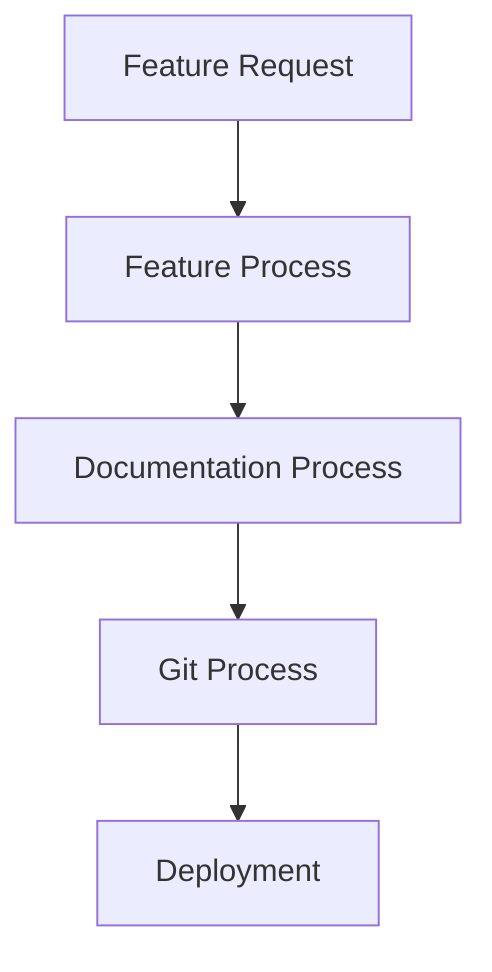

# VyOS API Development Processes

This document outlines the standard processes used in developing and maintaining the VyOS API automation service.

## Table of Contents
- [Documentation Process](#documentation-process)
- [Git Process](#git-process)
- [Feature Development Process](#feature-development-process)

## Documentation Process

### Purpose
Ensures comprehensive and up-to-date documentation for all aspects of the project.

### Steps
1. Write/Update documentation
   - Ensure clear, concise language
   - Use consistent formatting
   - Include code examples where relevant

2. Include examples and use cases
   - Add to `EXAMPLES.md` for API endpoints
   - Include Python, curl, and Postman examples
   - Show real-world usage scenarios

3. Maintain consistent formatting
   - Use Markdown consistently
   - Follow established structure
   - Keep code examples properly indented

4. Cover all features
   - Document each API endpoint
   - Include request/response formats
   - Document error cases

5. Update related configuration files
   - Update `requirements.txt` if new dependencies
   - Update systemd service if needed
   - Update installation scripts

6. Include installation and setup
   - Keep `vyos-installation.md` current
   - Update environment requirements
   - Document configuration options

### When to Use
- Adding new features
- Modifying existing features
- Fixing bugs that change behavior
- Updating dependencies
- Making security changes

## Git Process

### Purpose
Maintains clean version control and facilitates collaboration.

### Steps
1. Check current status
   ```bash
   git status
   ```
   - Review modified files
   - Check for untracked files

2. Review changes
   ```bash
   git diff
   ```
   - Verify changes are correct
   - Check for unintended changes

3. Verify last commit
   ```bash
   git log -1 --pretty=format:"%h %s"
   ```
   - Ensure previous commit is correct
   - Check commit message clarity

4. Push to repository
   ```bash
   git push origin main
   ```
   - Push changes to remote
   - Verify successful push

### When to Use
- After completing feature development
- After documentation updates
- After bug fixes
- After security patches

## Feature Development Process

### Purpose
Ensures systematic and thorough implementation of new features.

### Steps
1. Design & Planning
   - Document requirements in `TODO.md`
   - Define API endpoints
   - Plan code changes
   - Consider security implications

2. Implementation
   - Write core functionality
   - Update models/schemas
   - Implement error handling
   - Add security controls
   - Follow PEP 8 style guide

3. Documentation
   - Add to `docs/EXAMPLES.md`
   - Update `docs/api-reference.md`
   - Update `docs/user-guide.md`
   - Document configuration

4. Testing
   - Test new endpoints
   - Verify existing functionality
   - Test security controls
   - Test error cases
   - Document test cases

5. Version Control
   - Follow Git process
   - Use clear commit messages
   - Update version numbers if needed

### Best Practices
- Keep code DRY (Don't Repeat Yourself)
- Follow REST API conventions
- Use consistent naming
- Include proper error handling
- Add logging where appropriate
- Consider backward compatibility

### When to Use
- Implementing new features
- Making significant changes to existing features
- Adding new API endpoints
- Changing core functionality

## Using These Processes

1. For New Features:
   - Start with Feature Development Process
   - Follow with Documentation Process
   - End with Git Process

2. For Documentation Updates:
   - Use Documentation Process
   - End with Git Process

3. For Bug Fixes:
   - Use relevant parts of Feature Process
   - Update documentation if needed
   - End with Git Process

4. For Security Updates:
   - Follow Feature Process with security focus
   - Update security documentation
   - End with Git Process

## Process Integration

These processes are designed to work together:



Remember:
- Processes can be adapted as needed
- Documentation is as important as code
- Security considerations are paramount
- Version control should be consistent
